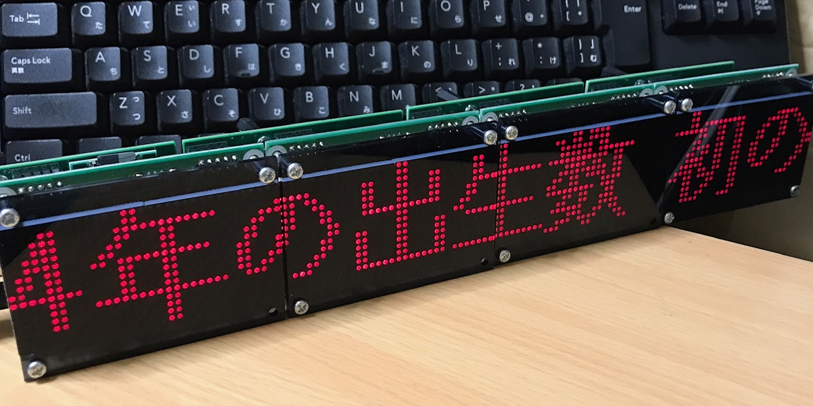
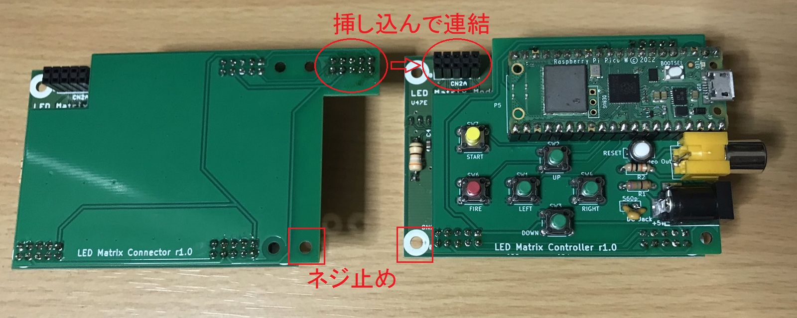
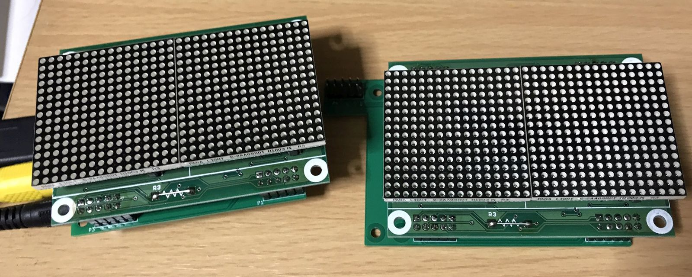
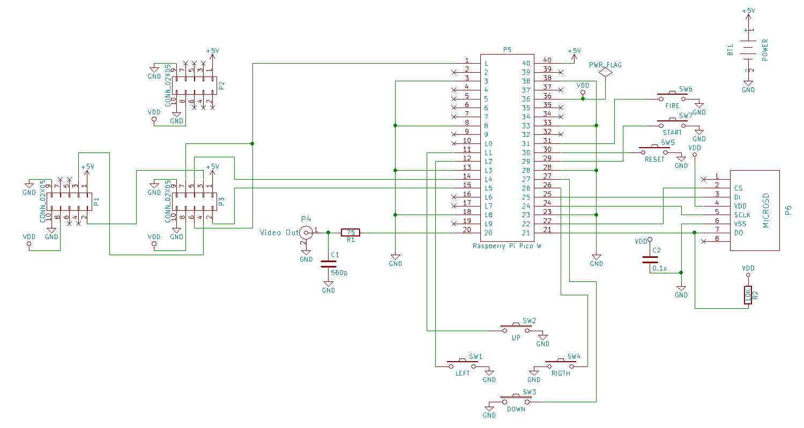
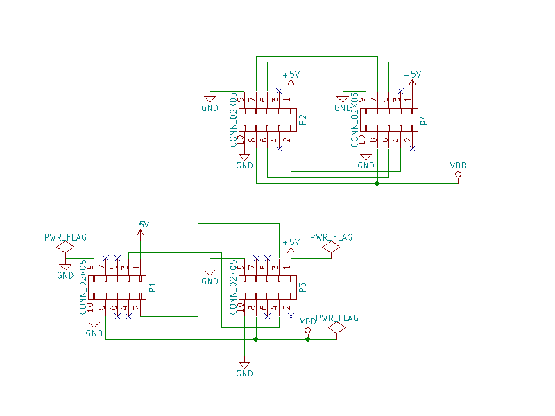

# LEDマトリクスメッセージボード
東京秋葉原の秋月電子で複数枚購入した横32x縦16ドットのLEDマトリクス基板を複数枚つなげて、インターネットのニュース等の日本語も表示可能なメッセージボードを製作しました。  
この基板は3本のシフトレジスタとラッチ、LEDドライバなどから構成されていますが、各シフトレジスタのシフト出力側も端子が出ていることから、これらの3本のシフトレジスタを直列接続し、さらに同じ基板を複数枚数珠つなぎで接続し1本の長いシフトレジスタとして見立てることで、増設可能なSPI制御できるLEDマトリクス基板となります。  
制御にはWiFi利用ができるRaspberry Pi Pico Wに、BASICコンパイラを搭載しI/O機器制御も可能なオープンシステムMachiKania type PUをインストールして使いました。USBキーボードとモニタを接続することで制御用BASICプログラムを直接修正することが可能です。  
ここでは開発した基板のガーバーデータファイルと実行プログラム等を公開しています。  
  
## 必要部品
* LEDマトリクス基板（1枚～必要数）  
* LEDマトリクス制御基板（[ガーバーデータ](gerber/ledmatrix.zip)、Githubではdownload raw fileからダウンロード）（1枚）  
* LEDマトリクス連結基板（[ガーバーデータ](gerber/ledmatrix_connector.zip)、Githubではdownload raw fileからダウンロード）（LEDマトリクス基板の数-1枚）  
* Raspberry Pi Pico W（1個）  
* [マイクロSDカードスロットDIP化キット](https://akizukidenshi.com/catalog/g/g105488/) （1個）  
* 5x2列ピンヘッダー（LEDマトリクス基板の数x4-1個）  
* 5x2列ピンソケット（LEDマトリクス基板の数x4-1個）  
* 20x1列ピンソケット（Raspberry Pi Pico W用、2個、基板に直接ハンダ付けする場合は不要）  
* [4本足6ミリタクトスイッチ](https://akizukidenshi.com/catalog/g/g103646/)（6個、リンク先は一例）  
* [2本足タクトスイッチ](https://akizukidenshi.com/catalog/g/g108080/)（リセットボタン用1個、リンク先は一例）  
* 抵抗器（10KΩ 1個、75Ω 1個）  
* 積層セラミックコンデンサ（0.1μF 1個、560pF 1個）  
* [DCジャック](https://akizukidenshi.com/catalog/g/g106568/)（1個、リンク先は一例）  
* [基板用RCAジャック](https://akizukidenshi.com/catalog/g/g106508/)（1個）  
* ACアダプタ　5V、1A以上（LEDマトリクス基板の数による）、内径2.1mm、外径5.5mm、センタープラス  
* マイクロSDカード（小容量で十分）  
* USB OTGアダプタまたはケーブル（USBキーボード利用時）  
* スペーサ、ネジなど必要に応じて（適宜）  
* その他　USBケーブル、USBキーボード、ビデオケーブル、ビデオ入力端子のあるテレビなど
## 製作方法
必要な基板と部品を入手し、ハンダ付けを行ってください。  
### LEDマトリクス基板
5x2列のピンソケットをLEDマトリクスとは反対面のCN1A、CN1B、CN2Bに付けます。CN2Aは複数枚のLEDマトリクス基板を連結利用する場合のみピンソケットを取り付け、最後の1枚には取り付け不要です。  
ピンソケットのハンダ付けは基板にしっかり密着するように行ってください。浮いて傾いたまま取り付けると、基板同士の接続が困難となります。この後のピンヘッダーの取り付けも同様に注意してください。  
### LEDマトリクス制御基板
BASICコンパイラ搭載システムMachiKania type PUを製作します。  
基板のおもて面（LED Matrix Controllerの印刷のある面）に各種スイッチ、抵抗器、コンデンサ、DCジャック、RCAジャック、Raspberry Pi Pico W用ソケットを取り付けます。  
5x2列のピンヘッダーとマイクロSDカードスロット基板は、基板裏面に取り付けてください。マイクロSDカードスロットを最初に付けると反対面の部品が取り付けできなくなるのでご注意ください。  
### LEDマトリクス連結基板
LEDマトリクス基板を複数枚連結利用する場合のみ必要な基板です。LEDマトリクス基板の連結数より1枚少ない枚数ご用意ください。  
基板の裏面（LED Matrix Connectorの印刷の反対面）に5x2列ピンヘッダーを取り付けるだけで完成です。  
### ソフトウェアの準備
[MachiKania type PU](http://www.ze.em-net.ne.jp/~kenken/machikania/typepu.html)の動作に必要なソフトウェアや設定ファイルを用意します。
#### MachiKania type PUシステムのインストール
LEDマトリクス制御基板に挿す前にRaspberry Pi Pico WにMachiKania type PUのシステムをインストールします。（挿したままでも構いません。）  
Pico W基板上のBOOTSELボタンを押しながらパソコンとPico WをUSBケーブルで接続し、表示されたPico Wのウィンドウに以下の.uf2ファイルをコピーしてBOOTSELボタンを離します。これでMachiKania type PUシステムのインストールは完了です。  
  
> [MachiKania type PU → 「ダウンロード」](http://www.ze.em-net.ne.jp/~kenken/machikania/typepu.html#download) → 「Download」  
このmachikania-pu-xxx.zipを解凍した「pico_w_ntsc」フォルダ内の「puerulus_kb.uf2」  
※USBキーボードを接続しない場合は同じフォルダの「puerulus.uf2」でも可  
#### マイクロSDカードに必要ファイルをコピー
FAT32形式でフォーマットされたマイクロSDカードをパソコンのカードリーダライタに挿し込み、必要なファイルをコピーします。  
* ライブラリファイル  
先ほどダウンロードしたmachikania-pu-xxx.zipの「LIB」フォルダをフォルダごとマイクロSDカードのルートディレクトリにコピー  
* 設定ファイル  
[MACHIKAP.INI](MACHIKAP.INI)の「WIFISSID=xxxxxxxxxxxxx」と「WIFIPASSWD=yyyyyyyyyyyyy」の部分を利用環境のWiFiルータのSSIDとパスワードに変更したものをマイクロSDカードのルートディレクトリに保存  
※このMACHIKAP.INIはLEDマトリクス基板をSPIチャネル1で利用するため、通常MachiKania type PUで使用している設定ファイルに以下の設定を追加しています。お手持ちのMachiKania type PUで本公開プログラムを利用する場合などは合わせて以下の設定をお願いします。  
``
SPIMISO=12
SPIMOSI=11
SPICLK=10
``
* メイン実行プログラム  
[LEDMSGBD.BAS](LEDMSGBD.BAS)の28行目の「NUM=」の数を連結するLEDマトリクス基板の枚数に合わせて修正したものをマイクロSDカードのルートディレクトリに保存。単体の場合は「NUM=1」とする
### 接続
制御基板裏側の3個のピンヘッダーをLEDマトリクス基板のピンソケットに合うように挿します。このとき必ず印刷された文字の上下が合う向きになるよう注意してください。**逆向きに挿すと壊れます。** 連結基板を利用する場合も同様に文字の向きが合うようにしてください。  
LEDマトリクス基板の連結は、制御基板や連結基板のはみ出たピンヘッダーをとなりのLEDマトリクス基板のソケットに挿すことで行います。LED面から見て一番左側が制御基板となります。一度挿し込んだ基板を抜く際には、各ソケットからヘッダーを少しずつゆっくり抜くようにしてください。慌てて斜めに引っ張るとピンが曲がりますのでご注意ください。  
多数のLEDマトリクス基板を利用する場合、連結基板のコネクタだけでは強度が弱いため、連結コネクタとは反対側のネジ穴を使って長めのネジで止めると安心です。  
  
  
## 使い方
### プログラムの実行
全ての基板接続が完了したらいよいよ動作確認です。  
Raspberry Pi Pico Wは制御基板のソケットに、USBコネクタのあるほうが基板の外に少しはみ出す方向にして挿してください。作成済みのマイクロSDカードは制御基板裏のソケットに入れてください。ビデオ端子をモニタ機器に接続したら、ACアダプタをDCジャックにつないで電源投入してください。  

電源投入するとモニタ画面にはMachiKania type PUの起動メッセージが表示されます。WiFiの接続に成功し、マイクロSDカードの読み取りも成功すると、カード内のファイル一覧表示となります。ここで、上下左右ボタンを使って「LEDMSGBD.BAS」に矢印を合わせてFIREボタンを押すと、コンパイラが起動しLEDマトリクスにインターネットのニュースタイトルのスクロール表示が始まります。モニタ画面への出力は停止となりますので、ビデオケーブルは抜いても構いません。終了するときは電源断してください。リセットボタンで再度起動画面に戻ることもできます。  
### USBキーボード接続
USBキーボードを利用すると、実行プログラムの作製、修正をMachiKania type PU上で行うことができます。USBキーボードを利用するにはRaspberry Pi Pico WのマイクロUSBコネクタにUSB OTGアダプタをつなぎ、その先にUSBキーボードをつなぎます。USBキーボードを接続した状態でMachiKania type PUを起動すると、USBキーボードを認識したメッセージを表示し、プログラムエディタ画面となります。ここでF1キー（LOAD）を押すとファイル一覧が表示され、カーソルキーで「LEDMSGBD.BAS」を選択してEnterキーを押すことで実際のBASICプログラムを編集画面に読み込みます。プログラムの実行はF4キー（RUN）で行います。実行中のプログラムを停止する場合はPause/Breakキーを押してください。編集画面に戻ることができます。   
### プログラムの自動起動方法
MachiKania type PUではマイクロSDカードのルートディレクトリに「MACHIKAP.BAS」というファイルが存在すると、システム起動時にファイル選択画面やエディタは呼び出さず、このBASICプログラムを読み込み自動的にコンパイルして実行します。USBキーボード接続して「LEDMSGBD.BAS」をエディタに読み込み、F2キー（SAVE）でファイル名を「MACHIKAP.BAS」と変更して保存するか、またはパソコンを使ってマイクロSDカードの「LEDMSGBD.BAS」を「MACHIKAP.BAS」とファイル名変更することで、次回起動時からは自動的にLEDメッセージプログラムが起動するようになり、モニタやキーボードを接続する必要がなくなります。  
自動起動をやめたい場合は、パソコンにマイクロSDカードを挿し、「MACHIKAP.BAS」を削除またはファイル名変更してください。  
## 回路図
制御基板  
  
連結基板  
